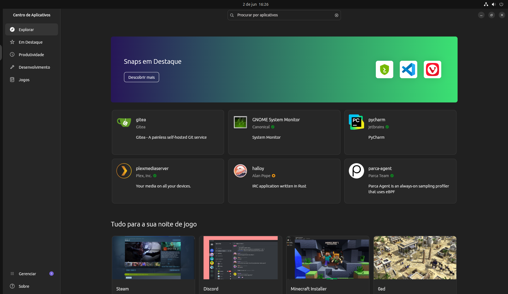
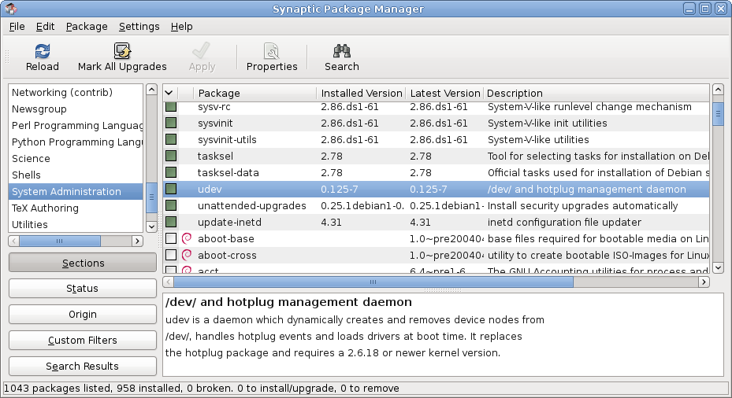
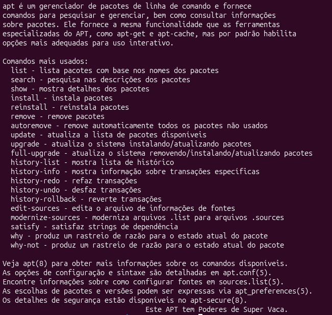
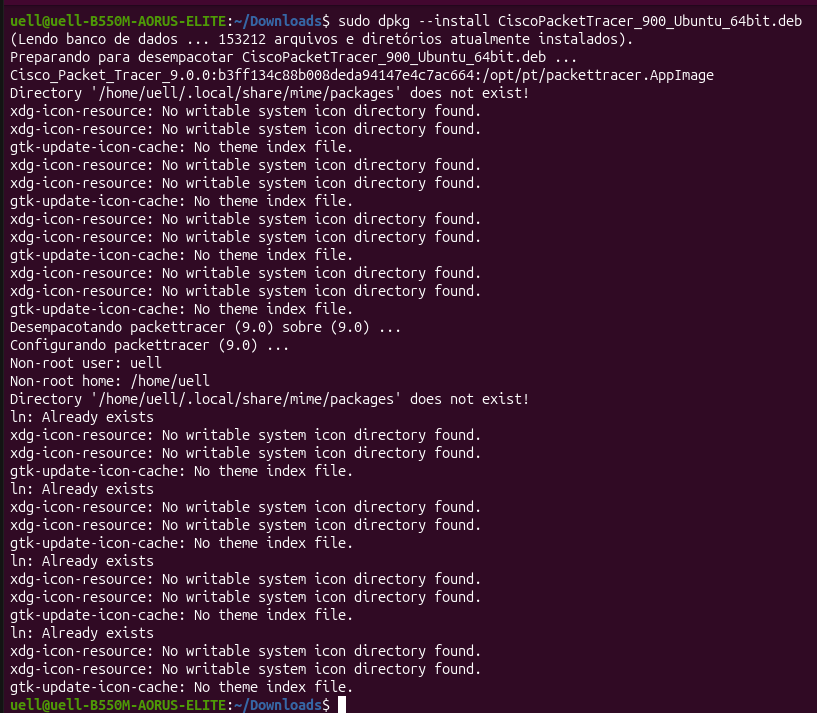
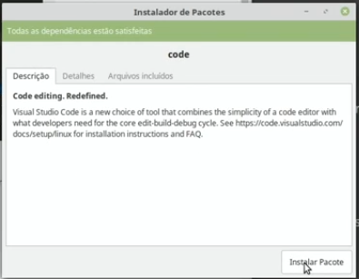

# Gerenciamento e Instalação de Aplicativos no Linux

## Gerenciador de Aplicativos

O gerenciador de aplicativos é a forma mais básica. No gerenciador de aplicativos basta pesquisar o aplicativo e baixar, funcionando por exemplo como a microsoft store ou a google play. O Gereciador de Aplicativos é a forma mais básica que temos para efetuar instalações no Linux.

Interface do Gerenciador de Aplicativos: 
 

## Synapitic

O Synaptic é a segunda forma mais simples. O Synaptic instala pacotes que já estão em um repositorio configurado no sistema, a desvantagem dele pro Gerenciador de Aplicativos é a interface um pouco mais complicada na parte da navegabilidade, muito pelo fato de aver extensões e blibliotecas dos aplicativos, a instalação é bem básica, basta procurar ou pesquisar pelo aplicativo e efetuar o download. Synapitic é uma das alternativas menos confortaveis.

Interface do Synaptic: 
 

## Terminal apt

O apt é um modo de instalação via terminal. O apt é uma ferramenta do Linux para manipulação de repositorios para instalação de programas, junto a essa ferramenta, além da possibilidade de instalação, ela aborda diversas opções de instalação, podendo remover, bloquear, listar, reinstalar. a muitas outras opções, para efetuar dowloads utilizando essa ferramenta basta digitar "apt install" mais o nome da instalação no terminal. caso queira saber todos os comandos do apt, basta digitar no terminal "apt".

Comandos do apt no terminal: 
 

## Instalação de programas externos via terminal (dpkg)

Os programas externos podem ser instalados via terminal. Para a instalação de pacotes externos pelo terminal utilizamos o dpkg, no terminal entramos na pasta onde se encontra o programa e digitamos o seguinte comando "sudo dpkg --install" e o nome do arquivo, dessa maneira podemos installar via terminal aplicativos externos, caso necessite de alguma dependencia basta digitar "sudo apt --fix-broken install" e instalara as dependencias dos programas dentro da pasta. Via terminal utilizamos dpkg, porém não é a unica forma de baixar aplicativos externos.

Comandos do dpkg no terminal: 
 

## Instalação de programas externos via Instalador de Pacotes

No Instalador de Pacotes é bem mais simples. Para instalar algo de forma mais simples, basta instalar o arquivo do programa e abrir ele com o Instalador de Pacote, dessa forma a instalação sera mais simples e atráves de ums interface grafica. Essa é a forma mais comum de instalar aplicativos externos.

Interface do Instalador de Pacotes: 
