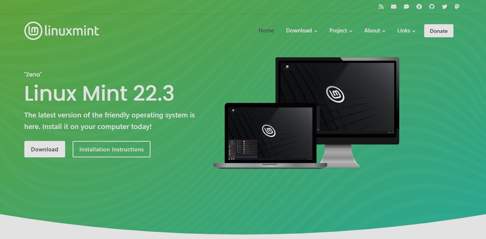
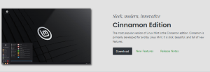
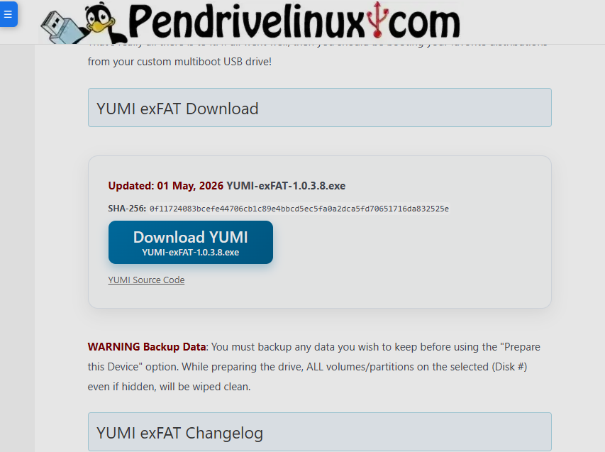

# Baixando e Configurando o Sistema Operacional Linux

## Distribuições 
O Linux não é um sistema operacional unico. Quando falamos de Linux estamos falando de diversos tipos de distribuição (Distro), são basicamente diferentes versões derivadas do Kernel Linux que funciona como motor, as distribuições são interfaces voltadas a públicos diferentes, por isso o Linux é um sistema operacional livre. Sabendo oque é uma distribuição podemos efetuar o download com base na sua escolha.

## Download da Distribuição
Para efetuar o Download devemos escolher a distribuição. Para um bom começo escolhemos o Linux Mint que é um Linux mais voltado a utilização simples e intuitiva, primeiramente devemos ir ao site oficial da distribuição https://linuxmint.com , escolher a versão que nesse caso é o Cinnamon Edition e escolher o repositorio que é o servidor do país onde você ta baixando, nesse caso Brasil mais especificamente o repositorio da Universidade Federal de Mato Grosso. Depois da instalação da iso podemos extrair o arquivo para o pendrie em conjunto com o Yumi https://pendrivelinux.com/yumi-multiboot-usb-creator/ para auxiliar no download, porém como é para aprendizado irei baixar em uma máquina virtual apenas usando o iso já consegue acessar o sistema operacional. Depois de Baixar podemos ir as configurações iniciais.

Site do Linux Mint: 
 
https://linuxmint.com 

Cinnamon Edition: 
 
https://linuxmint.com/download_lmde.php 

Yumi Site: 
 
https://pendrivelinux.com/yumi-multiboot-usb-creator/ 

## Configurações Iniciais
Ao entrar no sistema operacional Mint devemos configurar algumas coisas. Logo de primeira ja temos acesso a algumas coisas porém o sistema não está totalmente baixado, para efetuar o download completo basta clicar no icone de disco "Install Linux Mint", logo em seguida escolhemos a línguagem do sistema, fuso horário, tipo de teclado e informações do usuário, podendo escolher uma foto de pefil, nome de usuário e sua senha. Depois de tudo você pode configurar os dados do HD caso tenha algo, ele ja cria uma partição mais caso queira pode editar a partição, na ultima etapa o sistema te da a opção de baixar o GRUB que serve para caso tenha dois sistemas operacionais podendo alternar entre eles, depois basta clicar en instalar e o sistema operacional vai ta pronto. Depois de configurar tudo basta utilizar o sistema operacional.