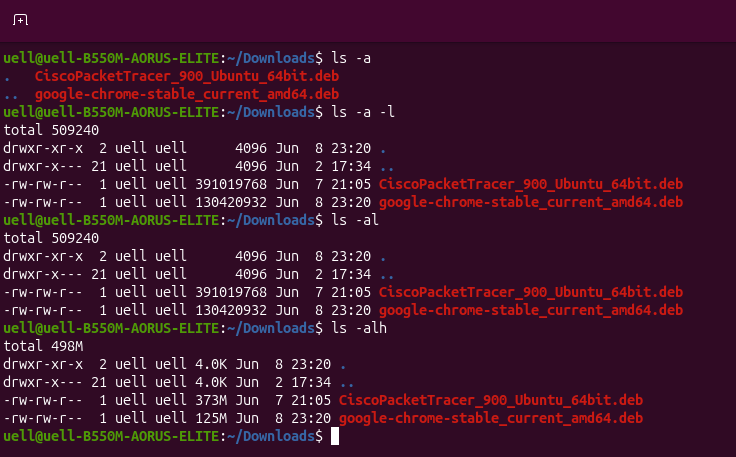

# Terminal: Fundamentos Básicos

## Considerações iniciais: Oque é terminal? para que serve?

O terminal é a conexão do usuário com o sistema operacional. No Linux o terminal é o ponto chave para o controle e navegação do sistema, atuando como um porta voz do usuário para o sistema, possibilitando com que possamos manipular diretórios, arquivos, redes, sistema operacional e até mesmo automação de tarefas. Para poder entender um pouco mais podemos ver alguns conceitos atrelados aos comandos.

## Parâmetros 

Os parâmetros são as "extensões" dos comandos. Todos os comandos tem um pârametro ou sua grande maioria, esses parâmetros servem para sinalizar ao comando inicial o comportamento que o usuário busca da quele comando, parâmetros podem ser utilizados mais de uma vez no comando junto ou separado, permitindo comportamentos diferentes referentes a raiz do comando, os parâmetros vem acompanhados de um travessão "-" antes do parâmetro que pode ser tanto representado com uma letra "-a" quanto pelo nome inteiro com adicional de mais um travessão "--all". para melhor compreensão alguns exemplos seram exibidos.

Exemplos de Parâmetros com ls (exibe arquivos e diretórios) 
 

## Comandos, Parâmetros  e Funções Frequentes

Muitos comandos são frequentemente usados no terminal Linux. Quando falamos de terminal, logo de inicio costumamos atrelar a algo complicado, porém com uma base de comandos que ajudam na navegabilidade de forma simples podemos desvincular essa ideia. Dito isso vamos as descrições dos comandos.

- cd (Change Directory): O comando cd é o comando responsável por entrar em diretórios, básicamente o remo na navegação pelo cmd. A forma em que ele é utilizado é cd + nome da pasta ou o caminho, essa é a forma padrão de utilizalo. Os parâmetros do cd são como atalhos, alguns exemplos a baixo:

    - ..: o "cd .." é responsavel por voltar ao diretório anterior.
    - ~: o "cd ~" é responsavel por voltar a pasta home ou comumente conhecida como pasta do usuário.
    - &#45;: o "cd -" é responsavel por voltar ao ultimo diretório antes do comando atual.

- ls (List): O comando ls exibe as pastas e arquivos no diretório onde é chamado, possui diversos parâmetros permitindo que veja mídias oculta, data, hora, ano, tamanho, dono, entre outras muitas opções. alguns parâmetros são mais usados que outros, esses são:

    - -l: exibe o formato longo das mídias (tamanho, dono e detalhes de permissão).
    - -h: exibe os valores de tamanho legíveis sem ser em bytes (KB, MB, GB).
    - -1: força a lista a exibir um arquivo por linha.
    - -m: lista os arquivos em lista separados por vírgula.
    - -a: mostra os arquivos ocultos, representados por um ponto "." no começo no nome.
    - -A: mostra os ocultos mais esconde os diretórios do sistema.
    - -d: mostra os detalhes do diretório onde foi chamado.
    - -t: organiza os arquivos pela data de modificação.
    - -S: ordena os arquivos por tamanho (maior para o menor).
    - -r: ordena os arquivos por tamanho (menor para o maior).
    - -X: agrupa os arquivos por ordem alfabética da extensão.

- pwd (Print Working Directory): Esse comando mostra o caminho absoluto da pasta onde foi chamado. é um comando bem basico e a dois parametros:

    - -L: mostra o caminho que você digitou para chegar ali, ignorando atalhos em outros locais.
    - -P: mostra o caminho digitado e o físico no HD, revelando para onde de fato o diretório aponta.

- mkdir (Make Diretory): O comando permite a criação de pastas através do terminal. O comando é usado da seguinte maneira "mkdir + nome da pasta", apesar de bem básico a alguns parâmetros:

    - -p: cria toda estrutura de uma pasta de uma vez só, por exemplo caso queria criar uma pasta com mais três pastas dentro basta utilizar "mkdir -p pasta1/pasta2/pasta3".
    - -m: define permissões a uma pasta no momento de criação, por exemplo para criar uma pasta que só o dono pode alterar "mkdir -m 755 pasta1".
    - -v: exibe se a pasta foi criada com sucesso, básicamente retorna o sucesso da tarefa.

- rm (Remove): Remove diretórios ou arquivos de forma definitiva. É utilizado assim "rm + nome da pasta/arquivo", alguns parâmetros são apricaveis:

    - -r: remove a pasta inteira.
    - -f: ignora avisos e apaga tudo.

- cp (Copy): Copia arquivos e pastas de um lugar para o outro. É utilizado assim "cp pasta_copiada caminho", Alguns parâmetrossão bem importantes são aplicados:

    - -r: copia a pasta inteira com subpasta e arquivos.
    - -i: pergunta se quer substituir um arquivo caso já existente.
    - -f: força a cópia apagando o arquivo cado já existente.
    - -p: mantém os arquivos originais sem alterar a origem da pasta com cópias iguais.
    - -v: mostra exatamente oque está sendo copiado.

- mv (Move): Move arquivos e pastas de um lugar ao outro ou renomeia arquivos. É utilizado da seguinte maneira "mv arquivo caminho". alguns parâmetros são muito uteis:

    - -i: pergunta se quer substituir se á alguma pasta com o mesmo nome.
    - -f: força a substituição de pastas com o mesmo nome.
    - -n: bloqueia a substituição de arquivos, consequentemente alterando o nome dos arquivos iguais.
    - -v: mostra exatamente para onde vai o arquivo.

- --help: O "--help" é um parâmetro não um comando, porém é extremamente benefico pois ajuda muito caso tenha duvida com algum comando. É utilizado da seguinte forma "comando que precisa de ajuda --help", assim é passado todas as informações necessarias do comando digitado.

- Tab: O "Tab" é uma tecla extremamente importante na navegação dentro do terminal, Ele auxilia na navegação completando comandos e nomes próprios, quando não sabe o nome ou o comando no terminal, basta digitar até onde lembra e completar com o Tab, caso não exista ou tenha mais de um o Tab te volta os possiveis comandos ou arquivos que você procura.